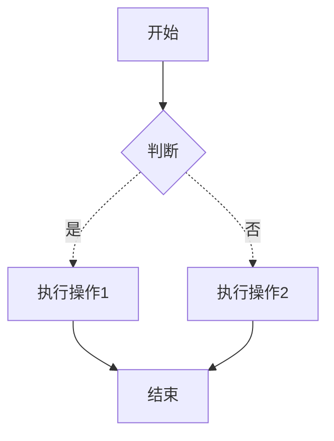

## 介绍：
- Mermaid 是用于**流程图绘制**的 Markdown 
- **示例**：

### 代码如下 ：
```text
flowchart TB
	A[开始] --> B{判断}
	B -.是.-> C[执行操作1]
	B -.否.-> D[执行操作2]
	C --> E[结束]
	D --> E
```
代码块使用 ` ```mermaid``` ` 包裹
 **解释:**
   * `graph TD`: 定义了一个图表，方向是从上到下 (Top-Down)。你也可以使用 `LR` (Left-Right) 从左到右。
   * `A[开始]`: 定义了一个节点 A，文本为“开始”，使用方括号 `[]` 表示矩形（默认）。
   * `B{判断}`: 定义了一个节点 B，文本为“判断”，使用花括号 `{}` 表示菱形。
   * `C[执行操作1]`: 定义了一个节点 C，文本为“执行操作 1”。
   * `A --> B`: 定义了一个从节点 A 到节点 B 的箭头。
   * `B -->|是| C`: 定义了一个从节点 B 到节点 C 的箭头，带有标签“是”。
   * **常用节点形状:**
     * `[]`: 矩形 (默认)
     * `()`: 圆角矩形
     * `{}`: 菱形
     * `(())`: 圆形
     * `([text])`: 体育场形状
     * `>`: 旗形
     * `{{text}}`: 子例程形状